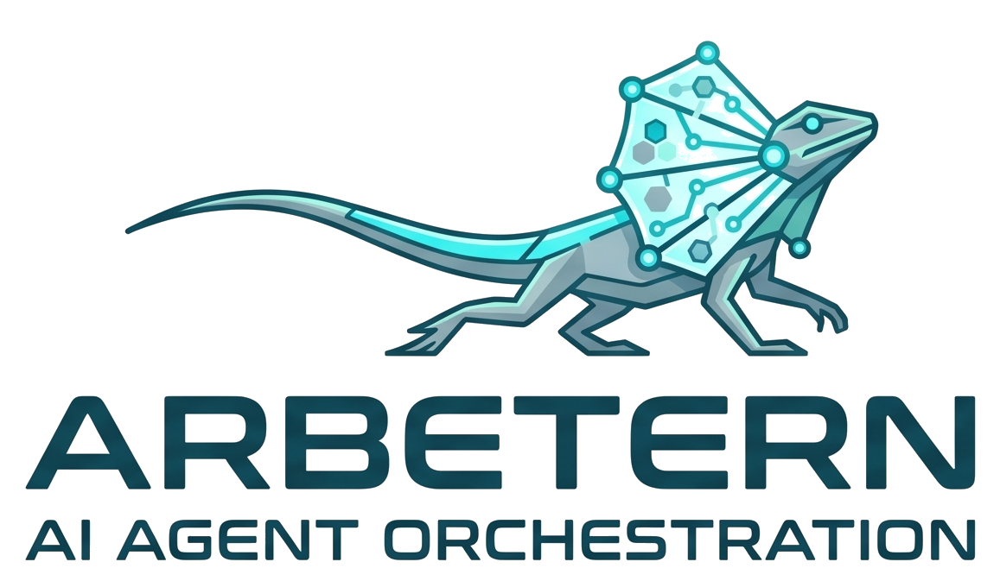

<p align="center">
  
</p>

<p align="center">
  <a href="https://github.com/justmike1/arbetern/stargazers"></a>
  <a href="https://go.dev"></a>
  <a href="LICENSE"></a>
  <a href="Dockerfile"></a>
</p>

<p align="center"><em>Yiddish for "workers." (with a typo, but it's cooler)</em></p>

An orchestration platform for AI agents in the enterprise. Each agent lives in its own directory under `agents/`, with dedicated prompts and a defined professional scope. Arbetern provides the runtime, routing, UI, and integrations — agents bring the expertise.

### [Read about it here.](https://medium.com/posts/c996daeb17d5)

### Screenshots

UI screenshots — home, dashboards, workflow grid, workflow editor — are in [screenshots/SCREENSHOTS.md](screenshots/SCREENSHOTS.md).

### Architecture — [Bernoulli Naive Bayes](https://en.wikipedia.org/wiki/Naive_Bayes_classifier) by Design

Arbetern's request pipeline is a chain of independent binary decisions — no MCP,
no external orchestrator, no shared state bus. Each stage observes one feature
and picks a class without influencing the next:

1. **Agent dispatch (prior).** Slack routes `/ovad`, `/pulse`, … to a dedicated
   HTTP handler. The agent ID picks the prompt set, RBAC policy, and tool
   palette before any content is read.
2. **Intent classification (binary scan).** Keyword lists fire independently
   (`isIntroIntent`, `isDebugIntent`); `requiresAction` acts as a conditional
   exclusion. First match wins.
3. **Tool loop (posterior update).** The general handler iterates LLM → tool
   calls → results until the model stops calling tools. The tool palette is
   feature-gated: each integration's `Ready()` flag toggles its tools in/out
   of the LLM's function list at request time.
4. **Model switch.** Detecting a code-related tool call dynamically swaps the
   general model for `CODE_MODEL` mid-inference, without restarting the loop.
5. **Thread sessions (temporal memory).** After the first reply a session is
   registered on the Slack thread; follow-ups re-enter the same router with
   accumulated history (see [Conversation Context](#conversation-context)).

Every layer is an independent binary decision — no sequential boosting, no
ensemble voting, no external orchestration. The system is the product of
independent feature states, which is the core assumption of Bernoulli Naive
Bayes.

## Current Agents

| Agent | Profession | Description |
|---|---|---|
| **ovad** | DevOps & SRE Engineer | Debugs CI/CD failures, reads/modifies repo files, opens PRs, searches Datadog logs/monitors/infrastructure, runs read-only SQL on a Databricks warehouse, and reports ClickHouse Cloud usage cost — all from a Slack slash command |
| **agent-q** | QA & Test Engineer | Analyzes test failures, reviews test coverage, suggests test cases, and triages flaky tests |
| **goldsai** | Security Researcher | Assesses CVE impact on your codebase, audits dependencies, reviews code for vulnerabilities, and recommends remediation |
| **seihin** (製品) | Sr. Technical Product Manager | Reviews and refines Jira tickets, rewrites descriptions with PM best practices, manages ticket quality at scale |
| **pulse** | Customer Success Engineer | Tracks account health, surfaces renewal signals from Salesforce, analyzes call intelligence and deal momentum from Chorus, manages CS workflows, and coordinates with Jira |

## Quick Start

### Prerequisites

- Go 1.26+
- A Slack app with a slash command pointing to `/<agent>/webhook` (see [docs/SLACK_BOT.md](docs/SLACK_BOT.md))
- A GitHub PAT with repo access (see [docs/GITHUB_PAT.md](docs/GITHUB_PAT.md))
- (Optional) Azure OpenAI credentials for LLM inference

### Environment Variables

The core variables you'll set on day one:

| Variable | Required | Description |
|---|---|---|
| `SLACK_BOT_TOKEN` | yes | Slack bot OAuth token (`xoxb-...`) |
| `SLACK_SIGNING_SECRET` | yes | Slack app signing secret |
| `GITHUB_TOKEN` | yes\* | GitHub PAT (\*or use Azure OpenAI for inference) |
| `GENERAL_MODEL` | no | General model ID (default: `openai/gpt-4o`) |
| `CODE_MODEL` | no | Model used for code-related tasks (default: same as `GENERAL_MODEL`) |
| `AZURE_OPEN_AI_ENDPOINT` / `AZURE_API_KEY` | no | Azure OpenAI credentials (alternative to GitHub Models) |
| `APP_URL` | no | Public app URL (used for Jira ticket stamps and Slack links) |
| `PORT` | no | HTTP port (default: `8080`) |

<details>
<summary><b>Runtime tuning</b> — sessions, tool rounds, UI access</summary>

| Variable | Description |
|---|---|
| `SLACK_APP_TOKEN` | Slack app-level token (`xapp-...`) for Socket Mode — enables thread follow-ups without slash commands (see [docs/SLACK_BOT.md](docs/SLACK_BOT.md#socket-mode-thread-follow-ups)) |
| `THREAD_SESSION_TTL` | Duration a thread session stays active (default `3m`, Go duration). Also controls the channel-context cache TTL |
| `MAX_TOOL_ROUNDS` | Max LLM tool-call rounds per request (default `200`) |
| `SHOW_USAGE_STAMP` | Append model/token usage metadata to Slack replies. Default `true` |
| `UI_ALLOWED_CIDRS` | Comma-separated CIDRs allowed to access the UI |
| `UI_HEADER` | Custom header text for the web UI (default `arbetern`) |

</details>

<details>
<summary><b>Persistence</b> — dashboards, workflows, user context, chat</summary>

All live under `persistence.mountPath` in the chart and default to `./data/<feature>` locally. See [Helm / persistence](#helm--persistence) for the consolidated values block.

| Variable | Description |
|---|---|
| `DASHBOARDS_DIR` | Directory for dashboard JSON snapshots (default `./data/dashboards`) |
| `WORKFLOWS_DIR` | Directory for workflow descriptors + run history (default `./data/workflows`) |
| `USER_CONTEXT_DIR` | Directory for per-user rolling conversation summaries (`<agent>/<user>/context.txt`). Defaults to a temp dir; the chart points it at the PVC when `userContext.enabled` is true |
| `CHAT_DIR` | Directory for centralized agent chat. Each agent holds many conversations (ChatGPT/Claude-style threads) stored at `<agent>/<conversation-id>.json`. Conversations are shared — everyone sees the same threads (no per-user auth yet). Chat is enabled per agent via `chat_enabled: true` in the agent's `config.yaml`; defaults to `./data/chat` |
| `CHAT_RETENTION` | How long a UI chat conversation is kept after its last activity before a background sweeper deletes it (applies to all agents). Go duration; defaults to `168h` (1 week). The sweeper runs hourly |
| `CUSTOM_PROMPTS_DIR` | Directory of custom prompt YAML files **appended** to built-in agent prompts. Set automatically by the chart when `customPrompts` is configured |
| `CUSTOM_CONFIG_DIR` | Directory of per-agent config overrides (`<agent-id>.yaml`, a full `config.yaml` overlay — e.g. `chat_enabled`, `allowed_teams`, `allowed_emails`). Set automatically by the chart when `customConfigs` is configured |
| `AGENT_CREDENTIALS_DIR` | Directory of per-agent credential overrides (`<agent-id>/<secret-key>` files). Set automatically by the chart when `customCredentials` is configured. See [Per-Agent Credentials](#per-agent-credentials-integration-overrides) |

</details>

<details>
<summary><b>Atlassian (Jira + Confluence)</b></summary>

| Variable | Description |
|---|---|
| `ATLASSIAN_URL` | Atlassian instance URL (e.g. `https://yourorg.atlassian.net`) |
| `ATLASSIAN_EMAIL` / `ATLASSIAN_API_TOKEN` | Basic Auth credentials |
| `ATLASSIAN_CLIENT_ID` / `ATLASSIAN_CLIENT_SECRET` | OAuth 2.0 client-credentials (alternative to Basic Auth) |
| `JIRA_PROJECT` | Default Jira project key (e.g. `ENG`) |

</details>

<details>
<summary><b>Other integrations</b> — NVD, Salesforce, Chorus, Datadog, AWS, Azure, Databricks, ClickHouse</summary>

| Variable | Description |
|---|---|
| `NVD_API_KEY` | NVD API key for CVE lookups. Free at <https://nvd.nist.gov/developers/request-an-api-key>. Without one, requests are rate-limited (~5 vs ~50 req/30s) |
| `SF_CONSUMER_KEY` / `SF_CONSUMER_SECRET` | Salesforce Connected App credentials (OAuth 2.0 client credentials flow) |
| `SF_LOGIN_URL` | Salesforce login URL (default `https://login.salesforce.com`; use `https://test.salesforce.com` for sandbox) |
| `CHORUS_API_TOKEN` | Chorus (ZoomInfo) API token. Generated in Chorus → Personal Settings |
| `CHORUS_BASE_URL` | Chorus API base URL (default `https://chorus.ai`) |
| `DD_API_KEY_US` / `DD_APP_KEY_US` | Datadog US (datadoghq.com) API + Application keys |
| `DD_API_KEY_EU` / `DD_APP_KEY_EU` | Datadog EU (datadoghq.eu) API + Application keys |
| `AWS_ACCESS_KEY_ID` / `AWS_SECRET_ACCESS_KEY` | AWS static creds. `AWS_PROFILE` and EKS IRSA (`AWS_WEB_IDENTITY_TOKEN_FILE` + `AWS_ROLE_ARN`) also work. Enables the Cost Explorer **and** S3 tools; the IAM principal needs `ce:GetCostAndUsage`, `ce:GetCostForecast`, `ce:GetDimensionValues`, plus `s3:GetObject` / `s3:PutObject` / `s3:ListBucket` on any bucket the S3 tools touch. Each CE API call costs $0.01 |
| `AWS_REGION` | Region used to sign Cost Explorer SigV4 calls (default `us-east-1` — the only region hosting the CE endpoint). S3 auto-detects each bucket's own region, so it is unaffected by this value |
| `AZURE_TENANT_ID` / `AZURE_CLIENT_ID` / `AZURE_CLIENT_SECRET` | AAD service-principal credentials for the Azure Cost Management tools. Service principal needs `Cost Management Reader` at the tenant root management group (or a narrower MG) for tenant-wide cost reporting across every subscription. Distinct from `AZURE_OPEN_AI_ENDPOINT` / `AZURE_API_KEY` (Azure OpenAI as LLM backend) |
| `AZURE_MANAGEMENT_GROUP_ID` | Optional. Management-group scope for cost queries. Defaults to `AZURE_TENANT_ID` (tenant root MG — covers every subscription in the tenant) |
| `AZURE_AUTHORITY_HOST` / `AZURE_MANAGEMENT_HOST` | Optional sovereign-cloud overrides (Azure Government, China). Default to the public-cloud endpoints |
| `DATABRICKS_HOST` / `DATABRICKS_CLIENT_ID` / `DATABRICKS_CLIENT_SECRET` / `DATABRICKS_WAREHOUSE_ID` | Databricks SQL warehouse + OAuth M2M service-principal credentials. Enables the read-only `databricks_query` tool for the **ovad agent only**. SP needs `CAN USE` on the warehouse + `SELECT` on the target catalogs/schemas. See [docs/DATABRICKS.md](docs/DATABRICKS.md) |
| `CLICKHOUSE_KEY_ID` / `CLICKHOUSE_KEY_SECRET` / `CLICKHOUSE_ORGANIZATION_ID` | ClickHouse Cloud API key (HTTP Basic key ID + secret) and organization ID. Enables the read-only `clickhouse_usage_cost` billing tool for the **ovad agent only**. See [docs/CLICKHOUSE.md](docs/CLICKHOUSE.md) |

</details>

<details>
<summary><b>GitOps sync</b> — workflows + dashboards from a git repo</summary>

See [docs/GITOPS.md](docs/GITOPS.md). All variables reuse `GITHUB_TOKEN`.

| Variable | Description |
|---|---|
| `WORKFLOWS_GITOPS_REPO` | Enables sync: poll `<owner>/<repo>` for `<basePath>/<agent>/<id>.json` |
| `WORKFLOWS_GITOPS_OWNER` | Repo owner (defaults to bot's resolved owner) |
| `WORKFLOWS_GITOPS_BRANCH` | Branch (defaults to repo default) |
| `WORKFLOWS_GITOPS_BASE_PATH` | Base path inside the repo (default `arbetern/workflows`) |
| `WORKFLOWS_GITOPS_INTERVAL` | Poll interval (Go duration, default `5m`, minimum `30s`) |
| `WORKFLOWS_GITOPS_PRUNE` | When `true`, locally-managed workflows that disappear from git are deleted (default `true`) |
| `DASHBOARDS_GITOPS_*` | Same semantics as the `WORKFLOWS_GITOPS_*` knobs above. Default base path `arbetern/dashboards` |

</details>

### Run Locally

```bash
export SLACK_BOT_TOKEN=xoxb-...
export SLACK_SIGNING_SECRET=...
export GITHUB_TOKEN=ghp_...
go run .
```

### Docker

```bash
docker build -t arbetern .
docker run -e SLACK_BOT_TOKEN -e SLACK_SIGNING_SECRET -e GITHUB_TOKEN arbetern
```

### Helm

```bash
cp deploy.example.values.yaml deploy.local.values.yaml
# Edit deploy.local.values.yaml with your secrets
helm upgrade --install arbetern ./helm -f deploy.local.values.yaml
```

## Web UI

Visit `/ui/` to see all registered agents. Click an agent card to view its prompts (read-only). The UI auto-discovers agents from the `agents/` directory.

- Drop a `logo.png` into `ui/` to replace the default icon
- Set `UI_HEADER` env var to customize the navbar title
- Agents with `chat_enabled` expose a full-screen chat at `/ui/<agent>/chat` — a deep-linkable, reload-safe URL you can bookmark or share

### Authentication (SSO)

The Helm chart bundles the [oauth2-proxy](https://github.com/oauth2-proxy/manifests) subchart (disabled by default) to put Google/GitHub/etc. SSO in front of the browser UI. Enable it in your values:

```yaml
oauth2-proxy:
  enabled: true
  config:
    clientID: "<oauth-client-id>"
    clientSecret: "<oauth-client-secret>"
    cookieSecret: "<openssl rand -base64 32 | tr -- '+/' '-_'>"
```

When enabled, the chart automatically rewires the `ingress` backend to the proxy, so external traffic is authenticated before reaching the app. Only `/ui/` and `/api/` are gated — Slack webhooks (`/<agent>/webhook`) and `/healthz` stay public via `skip_auth_routes` (Slack can't complete an OAuth login), and Slack Socket Mode needs no inbound rule.

- Register `https://<your-host>/oauth2/callback` as an authorized redirect URI in your OAuth provider.
- With a single provider configured, the interstitial sign-in page is skipped and users go straight to the provider.
- This is independent of `UI_ALLOWED_CIDRS`; you can use either or both.
- The proxy passes the verified identity to the app as `X-Auth-Request-Email` (via `set_xauthrequest`). arbetern uses this to enforce per-agent chat access by email — see [Chat access by email](#chat-access-by-email-ui).

## Adding a New Agent

1. Create a directory under `agents/`:
   ```
   agents/my-agent/prompts.yaml
   ```
2. Define prompts in the YAML file (keys like `security`, `classifier`, `general`, `debug`, etc.)
3. Rebuild and deploy — the agent will appear in the UI and get a webhook at `/<agent-name>/webhook`
4. Create a Slack slash command pointing to `https://<your-host>/<agent-name>/webhook`

> **Note:** Each agent directory under `agents/` is automatically discovered at startup and registered with its own webhook route (`/<agent>/webhook`). Create a Slack slash command per agent pointing to the corresponding path.

## Conversation Context

Every Slack-driven request — DMs, channel mentions, slash commands, and in-thread follow-ups — is grounded in a layered context that the router composes into the LLM system prompt. Each layer has its own scope, retention, and size cap so the prompt stays useful without growing unbounded.

| Layer | Scope | Retention | Size cap |
| --- | --- | --- | --- |
| **Agent prompt** | Per agent, static | File on disk (read-only) | Whatever you author in `agents/<id>/prompts.yaml` (+ `CUSTOM_PROMPTS_DIR` overrides) |
| **Slack user profile** | Per request | Refetched every turn via `users.info` | A few hundred bytes (Slack ID, real name, display name, email, title) |
| **Channel context** | Per channel/DM | In-memory cache, TTL = `THREAD_SESSION_TTL` (default 3m). Background sweeper evicts stale entries; hard cap of 4096 channels with oldest-first eviction | Up to 50 most recent Slack messages (no per-message char cap) |
| **Conversation memory** | Per `(channel, user)` | In-memory, 10-minute TTL on inactivity. Background sweeper runs every minute; hard cap of 8192 pairs | Up to 10 turns (no per-turn char cap) |
| **User context (persistent)** | Per `(agent, user)`, shared across DMs and channels | File on disk at `<USER_CONTEXT_DIR>/<agent>/<user>/context.txt`. 30-day TTL on inactivity (refreshed on every append). PVC-backed in the Helm chart when `userContext.enabled` is true | Up to 50 entries (oldest dropped first), each capped at 800 chars (question) + 1200 chars (answer) + ~30 chars overhead, with a hard 96 KiB file ceiling |

### How it flows

1. **Read on every request.** All five layers are assembled before the LLM is called. The user-context file is read for both DMs and channels — `channelID` is *not* part of its key, so DM and channel turns merge into the same per-user file.
2. **Append on every completed turn.** When the model finishes, a compact `(question, answer)` entry is appended to the user-context file regardless of whether the request came from a DM or a channel. Scheduled workflow ticks (`ExecuteHeadless`) intentionally skip persistence.
3. **Cache reuse.** The channel-history cache TTL is wired to `THREAD_SESSION_TTL`, so a multi-turn thread reuses the same cached 50-message window for the entire session window without re-hitting Slack.

### Knobs

- **`THREAD_SESSION_TTL`** — controls both the thread-session lifetime *and* the channel-context cache TTL.
- **`USER_CONTEXT_DIR`** — where the persistent per-user files live. The Helm chart sets it under `persistence.mountPath` when `userContext.enabled` is true.
- All other size caps are constants in [commands/user_context.go](commands/user_context.go), [commands/context.go](commands/context.go), and [commands/memory.go](commands/memory.go) — adjust there if you need a different envelope.

### Persistence in Kubernetes

The user-context store shares the same PVC as dashboards and workflows. Set
`userContext.enabled: true` (default) and enable the PVC \u2014 see
[Workflows \u2192 Helm / persistence](#helm--persistence) for the full values block.

## Custom Prompts (Org-Specific Context)

You can append org-specific context to any agent's prompts without modifying the built-in `agents/*/prompts.yaml` files. Custom prompts are **appended** to existing prompt keys — they never override the originals.

### Via Helm (Kubernetes ConfigMap)

Add a `customPrompts` section to your values file:

```yaml
customPrompts:
  ovad:
    general: |
      Our GitHub org is "acme-corp". Default repo for infra is "infra-live".
      Terraform state is in S3 bucket "acme-tf-state".
      Production cluster is EKS "prod-us-east-1".
  goldsai:
    general: |
      All Python services must use Python >= 3.13.11.
      Container base images are in ECR at 123456789.dkr.ecr.us-east-1.amazonaws.com.
```

The Helm chart creates a ConfigMap, mounts it, and sets `CUSTOM_PROMPTS_DIR` automatically.

### Via Environment Variable (local / Docker)

Set `CUSTOM_PROMPTS_DIR` to a directory containing `<agent-id>.yaml` files:

```bash
export CUSTOM_PROMPTS_DIR=/path/to/custom-prompts
# Create /path/to/custom-prompts/ovad.yaml with prompt key/value pairs
```

## Agent RBAC (Team-Based Access Control)

Restrict which Slack user groups (teams) can access each agent. When `allowed_teams` is set for an agent, only members of those Slack user groups can invoke it. Empty list = open to everyone.

### Default Config (`agents/<id>/config.yaml`)

Each agent's `config.yaml` has an `allowed_teams` field:

```yaml
name: Pulse
allowed_teams:
  - S0A6S3KNNLW   # CS team user group ID
```

### Override via Helm (Kubernetes ConfigMap)

Use the generic `customConfigs` mechanism to override `config.yaml` at deploy
time. Each key is an agent ID; the value is a (possibly partial) copy of that
agent's `config.yaml`. Because the override is a full config file, only the keys
you set take effect and everything else falls through to the baked-in
`config.yaml`:

```yaml
customConfigs:
  pulse:
    allowed_teams:
      - S0A6S3KNNLW   # CS team
  ovad:
    allowed_teams:
      - S0A6S3KNNLW   # CS team
      - S0B7T4LOOLX   # DevOps team
```

The Helm chart creates a ConfigMap, mounts it, and sets `CUSTOM_CONFIG_DIR`
automatically. The same block is also how you toggle other per-agent settings
such as `chat_enabled`.

### Override via Environment Variable (local / Docker)

Set `CUSTOM_CONFIG_DIR` to a directory containing `<agent-id>.yaml` files (a
full `config.yaml` overlay):

```bash
export CUSTOM_CONFIG_DIR=/path/to/custom-config
# Create /path/to/custom-config/pulse.yaml:
# allowed_teams:
#   - S0A6S3KNNLW
```

### How it Works

1. On each slash command, arbetern checks if the agent has `allowed_teams` configured
2. If yes, it calls the Slack `usergroups.users.list` API to check if the user is a member of any allowed group
3. Group memberships are cached for 5 minutes to avoid API spam
4. Denied users see an ephemeral "Access denied" message
5. Deploy overrides (`customConfigs` / `CUSTOM_CONFIG_DIR`) **replace** (not merge) the `config.yaml` value

> **Slack scopes required:** `usergroups:read` for team membership, plus
> `users:read.email` if you use `allowed_teams` as the chat-UI fallback (to
> resolve an authenticated email to its Slack user). Add these to your Slack
> app's OAuth scopes.

### Chat access by email (UI)

`allowed_teams` gates Slack slash commands by Slack user group. The browser
**chat** (`/ui/<agent>/chat` and the underlying `/api/chat` endpoints) is gated
per agent by **two layers, evaluated in order**:

1. **`allowed_emails` (primary).** The address oauth2-proxy verified
   (`X-Auth-Request-Email`) is matched case-insensitively against the list —
   either an exact address or a whole domain. A match grants access.
2. **`allowed_teams` (fallback).** If the email is not in `allowed_emails`,
   arbetern resolves it to a Slack user (`users.lookupByEmail`) and checks
   membership in the agent's Slack user groups — the same `allowed_teams` used
   for slash commands. A match grants access.
3. **Otherwise → `403`.** If neither layer matches the request is denied.

This lets one `allowed_teams` list cover both Slack slash commands and the chat
UI: a user already in an authorized Slack team gets chat access without being
listed individually in `allowed_emails`. When **both** lists are empty the
agent's chat is unrestricted.

Layer 1 requires the [oauth2-proxy SSO](#authentication-sso) in front of the
app: the proxy authenticates the user with Google (or another provider) and
passes the verified address as `X-Auth-Request-Email`, which it also strips from
inbound requests so it can't be spoofed. Layer 2 additionally requires the
`users:read.email` and `usergroups:read` Slack scopes; it fails closed (no
access granted) if the email can't be resolved to a Slack user.

```yaml
customConfigs:
  pulse:
    chat_enabled: true
    allowed_emails:
      - solutions@acme.com   # exact address
      - acme.com             # any address in this domain
    allowed_teams:
      - S0A6S3KNNLW          # fallback: members of this Slack team also get in
```

When access is denied the chat API returns `403` and the UI shows a friendly
"you don't have access" message with the message composer hidden (no dead Send
button). Lookups (email→Slack-ID and team membership) are cached for 5 minutes
to stay within Slack's rate limits.

The same oauth2-proxy-verified email is used to attribute **Jira tickets created
from the chat UI**: the Reporter is set to that user's Jira account, matching the
behavior of Slack commands. See
[Reporter attribution](docs/ATLASSIAN.md#reporter-attribution).

## Per-Agent Credentials (Integration Overrides)

Each agent normally shares the same integration credentials (Salesforce, Atlassian, Chorus, Datadog, NVD, Azure cost). When a single agent needs its own Salesforce app / Atlassian tenant / Datadog account / etc. you can override individual keys *for that agent only* — every key you do not override falls through to the global value.

Overrides use the same kebab-case keys as the chart's `secretValues` map (e.g. `sf-consumer-key`, `atlassian-api-token`, `chorus-api-token`, `dd-api-key-us`, `azure-client-secret`, ...).

### Via Helm (per-agent Secret)

Add a `customCredentials` section to your values file:

```yaml
customCredentials:
  ovad:
    sf-consumer-key: "REPLACE_ME"
    sf-consumer-secret: "REPLACE_ME"
  pulse:
    chorus-api-token: "REPLACE_ME"
    dd-api-key-us: "REPLACE_ME"
    dd-app-key-us: "REPLACE_ME"
```

For every entry the chart provisions a Secret named `arbetern-<agent>-secrets` and mounts it at `/etc/arbetern/agent-credentials/<agent>/` (one file per key). `AGENT_CREDENTIALS_DIR` is set automatically.

When `createSecret: false` (recommended for production) the chart skips creating the Secret resources — provision them yourself with the matching name and the chart will still mount them:

```bash
kubectl create secret generic arbetern-ovad-secrets \
  --from-literal=sf-consumer-key=3MVG9... \
  --from-literal=sf-consumer-secret=...
```

Leave the corresponding `customCredentials.<agent>` map present (even if empty values) so the chart adds the volume mount.

### Via Environment Variable (local / Docker)

Set `AGENT_CREDENTIALS_DIR` to a directory containing one subdirectory per agent. Each file inside the subdirectory is treated as a single override value whose filename matches a kebab-case secret key:

```bash
export AGENT_CREDENTIALS_DIR=/path/to/agent-credentials
# /path/to/agent-credentials/ovad/sf-consumer-key
# /path/to/agent-credentials/ovad/sf-consumer-secret
```

### How it Works

1. At startup each agent's router is built with a per-agent copy of the config (`Config.ForAgent(agentID)` in [config/agent_credentials.go](config/agent_credentials.go))
2. Only integration clients whose credentials actually differ from the global config get rebuilt ([integrations_agent.go](integrations_agent.go)). Everything else reuses the shared global client — no extra connections
3. Supported keys: every kebab-case key from the chart's `secretValues` schema (Atlassian, Salesforce, Chorus, Datadog US + EU, NVD, Azure Cost service-principal, Azure OpenAI, GitHub, Slack). Unknown keys are ignored
4. **Limitation:** AWS credentials are resolved via the SDK chain (ambient env / IRSA), so `aws-*` overrides under `customCredentials` are *not* applied to the AWS client — use the global secret or a per-pod service account instead

## Dashboards

Agents can create **recurring data dashboards** on demand. Ask the agent in Slack:

```
/pulse create dashboard to show me all the details you have from your integrations regarding acme customer, make it sync every 5 minutes
```

The agent composes a dashboard from its allow-listed read-only integration sources
(`jira_search`, `salesforce_query`, `chorus_list_conversations`, `datadog_search_logs`,
`datadog_list_monitors`, `confluence_search`, `github_list_prs`), saves it as JSON at
`<DASHBOARDS_DIR>/<agent>/<dashboard-id>.json`, and spins up a background goroutine
that re-runs every source on the requested interval.

**Viewing:** each dashboard is served at `/<agent>/dashboard/<id>` as a self-refreshing
HTML page, with the raw JSON at `/<agent>/dashboard/<id>/data.json`. Every agent card
in the Web UI also shows an **Available dashboards** section listing its short-name
chips — click to open, `×` to delete.

**Lifecycle tools** (exposed to the LLM):

| Tool | Purpose |
|------|---------|
| `create_dashboard` | Compose a dashboard with name, short_name, sync_interval, and a list of sources. |
| `list_dashboards` | List the agent's active dashboards (ids, short names, last-sync times). |
| `delete_dashboard` | Stop the sync goroutine and remove the stored JSON. |

**Configuration:**

- `DASHBOARDS_DIR` — where JSON snapshots are persisted (default `./data/dashboards`).
- Sync interval is clamped to `[30s, 24h]`; the default is `5m`.
- Each source type maps 1:1 to an existing integration client and is read-only.

**Helm / persistence:** dashboards share the same PVC as workflows and the
user-context store — see [Workflows → Helm / persistence](#helm--persistence)
for the full values block. Setting `dashboards.enabled: true` is enough; the
chart wires `DASHBOARDS_DIR` to `<persistence.mountPath>/dashboards`
automatically.

**Global cross-agent command:** in any Slack channel, run `/arbetern list dashboards` to
get a single list of every active dashboard across every agent, with clickable view
links. No agent slash-command or LLM round-trip is involved — it reads straight from
the registry.

## Account Health Dashboards (`/<agent> dashboard <name>`)

In addition to LLM-composed source dashboards, any agent with Salesforce configured
gets a **first-class `dashboard` subcommand** that runs a fixed, deterministic
pipeline and replies with a Block Kit summary + a link to the full HTML view:

```
/pulse dashboard Sprout Social
/pulse dashboard Sprout Social --refresh
```

Pipeline on each invocation:

1. **Resolve** the account via fuzzy Salesforce `LIKE` search (exact match > prefix > contains).
2. **Fan out in parallel** to every configured integration — Salesforce opps, Jira
   open tickets mentioning the account, Chorus engagements (last 45d, filtered by
   account email domain when derivable from `Account.Website`), Datadog monitors
   tagged for the account or currently alerting.
3. **Compute a weighted health score** (0–100) from the signals below.
4. **Persist** a Kind=`account` dashboard under a slug-stable URL
   (`/<agent>/dashboard/acct-<slug>`) and cache the snapshot at
   `<DASHBOARDS_DIR>/_cache/account/<slug>.json`.
5. **Reply** with a Slack Block Kit summary: score badge, top 3 risks, top 3 action
   items, signal breakdown, and an **Open full dashboard →** button.

**Caching:** the first request of the day fetches fresh data and caches it for 24h.
Subsequent requests serve from cache unless `--refresh` (or `-r`) is passed.

**Score bands:** `80+` green · `60–79` yellow · `40–59` orange · `<40` red.

**Signal weights** (sum to 100):

| Signal | Weight | Key penalties |
|---|---|---|
| Ticket Health | 25 | Open P0/P1 (-15 ea), stale >14d (-10 ea), unassigned (-5 ea) |
| Infra Stability | 20 | Monitor in ALERT (-20 ea), WARN (-10 ea) |
| Engagement (Chorus) | 20 | No calls 30d (-20), competitor mentions (-10 ea), overdue items (-5 ea) |
| Comms (Slack/Email) | 15 | *Not yet instrumented — full credit in v1.* |
| License & Commercial | 20 | Renewal <60d with no open opp (-30) |

The HTML view renders a bar chart of signal score-vs-weight via Chart.js (loaded
from CDN), a coloured score badge, and the full source-panel tables underneath.

## Example `create_dashboard` Prompts per Agent

Every agent with `create_dashboard` available can also build **custom, sync-on-a-
timer dashboards** from its integration sources. Copy a prompt below verbatim as
the body of a slash command.

<details>
<summary><code>/pulse</code> — Customer Success</summary>

```
create dashboard "Acme 360" short-name acme-360 that syncs every 10m with:
- jira_search of JQL `project = ENG AND labels = acme AND resolution = Unresolved ORDER BY priority DESC`
- salesforce_query SOQL `SELECT Id, Name, StageName, CloseDate, Amount FROM Opportunity WHERE Account.Name = 'Acme' AND IsClosed = false`
- chorus_list_conversations with participants_email = @acme.com over the last 30 days, with_trackers: true
```

</details>

<details>
<summary><code>/ovad</code> — DevOps & SRE</summary>

```
create dashboard "Prod incidents today" short-name prod-today, every 5m, with:
- datadog_search_logs query `env:prod status:error` over the last 24h, limit 25
- datadog_list_monitors query `status:alert` limit 25
- github_list_prs for repo infra-live, state open, limit 15
```

</details>

<details>
<summary><code>/agent-q</code> — QA & Test</summary>

```
create dashboard "Flaky tests board" short-name flaky-tests that refreshes every 15m:
- jira_search JQL `labels in (flaky, test-failure) AND statusCategory != Done ORDER BY updated DESC`
- github_list_prs for repo api-service state open limit 20 (to cross-reference open test fixes)
```

</details>

<details>
<summary><code>/goldsai</code> — Security Research</summary>

```
create dashboard "Open vulns this quarter" short-name secops-q, every 30m, with:
- jira_search JQL `project = SEC AND labels = cve AND resolution = Unresolved ORDER BY priority DESC`
- confluence_search cql `label = "security-advisory" AND lastModified > now("-90d")`
```

</details>

<details>
<summary><code>/seihin</code> — Sr. Technical PM</summary>

```
create dashboard "PM intake queue" short-name pm-intake that syncs every 15m:
- jira_search JQL `project = PROD AND status = "Intake" ORDER BY created ASC` max_results 30
- confluence_search cql `label = "pm-rfc" AND lastModified > now("-14d")`
```

</details>

**Tips:** always provide a `short_name` (keeps the agent-card chip compact);
quote JQL/SOQL/CQL exactly as you'd type it in the native UI; start with a
5–15m `sync_interval` (clamped to `[30s, 24h]`); ask the agent
`what integrations do you have` if unsure which sources will resolve.

## Workflows

Agents can also own **recurring or event-triggered workflows** — scheduled
agent invocations that go beyond read-only dashboards. A workflow can open
PRs, post Slack messages, transition Jira tickets, etc., because each tick
re-enters the owning agent's full tool-loop (headless) with a pinned prompt.

Example prompt (the one that kicked off this feature):

```
/ovad create for me a workflow which polls every 5 minutes from jira open bug
tickets from the engineering project with the label "arbetern", reads and executes
upon the bug in github, and sends a slack message to channel C02S5BP9LHX that
a PR is created — when you create the PR, set claude as the assignee too so it
will review.
```

The owning agent synthesises a complete, credentialless prompt (channel IDs,
repo names, labels, assignees — everything needed so the tick is reproducible),
persists a JSON descriptor at `<WORKFLOWS_DIR>/<agent>/<id>.json`, and starts
a goroutine that ticks on the requested cron schedule. Each run's result + error
is appended to the descriptor; the viewer at `/<agent>/workflow/<id>` renders
the run history and auto-refreshes adaptively (every 3 seconds while a tick
is in flight, every 30 seconds otherwise). The header badge shows `running…`
(blue, pulsing) while a tick is executing, and the **Run now** button is
disabled until it completes.

### Boot behaviour

On server startup, both the workflow registry and the dashboard registry
**load all descriptors into memory and start their tickers, but do NOT fire
an immediate tick / sync**. Scheduled ticks run on their normal cadence;
user-initiated work (Create, the Run-now button, manual API calls) still
executes immediately. This keeps deploys quiet — a pod roll won't blast
every upstream the moment it comes up.

### GitOps sync (managing workflows + dashboards from a git repo)

Both workflows and dashboards can be **declared in a separate GitHub
repository** and auto-reconciled into their registries by a built-in
poller. Set `workflows.gitops.enabled=true` and/or
`dashboards.gitops.enabled=true` in `values.yaml` (or
`WORKFLOWS_GITOPS_REPO=...` / `DASHBOARDS_GITOPS_REPO=...` on the
deployment) and arbetern will poll the configured repo every 5 minutes
(configurable) for files matching `<basePath>/<agent>/<id>.json`:

```
arbetern/
├── workflows/
│   ├── ovad/
│   │   ├── aws-daily-cost.json
│   │   └── arbetern-autofix.json
│   └── seihin/
│       └── seihin-application-triage.json
└── dashboards/
    └── ovad/
        └── infra-overview.json
```

Each file uses the same shape as the corresponding on-disk registry
descriptor; runtime fields (run history for workflows, source data for
dashboards) are ignored on read so committing a file pulled from
`/api/workflows/...` or `/api/dashboards/...` Just Works. Items synced
this way are tagged `source = "gitops"` and become read-only in the UI
— the edit button is hidden, a banner links back to the source file in
git, and the API rejects non-`enabled` mutations on workflows /
deletes on either kind. See [docs/GITOPS.md](docs/GITOPS.md) for the
full reference, configuration matrix, and ConfigMap example.

### Cron scheduling (`cron`)

Scheduled workflows fire on a standard 5-field UTC cron expression. The
`cron` field is required for `trigger.type = schedule`; it defaults to
`@every 5m` when omitted on create.

```
0 5 * * *        # daily at 05:00 UTC
0 5 * * 0-4      # Sun–Thu at 05:00 UTC (skip Fri/Sat)
*/15 * * * *     # every 15 minutes
0 9,17 * * 1-5   # weekdays at 09:00 and 17:00 UTC
@every 1h        # every 1 hour from runner start
@daily           # midnight UTC
@hourly          # top of every hour
```

The runner sleeps until the next match of the expression (computed in UTC
via [`robfig/cron/v3`](https://github.com/robfig/cron)) and then fires the
tick in its own goroutine, so a slow tick never blocks the next scheduled
fire of the same workflow. Overlapping ticks are skipped via a per-workflow
busy try-lock so a long-running tick can't double-post or double-PR.

**Restart-resilient catch-up.** On server boot, if the most recent expected
fire time is after the workflow's recorded `last_run`, the runner fires a
single catch-up tick immediately (logged as `schedule:catchup`). This means
a daily 05:00 UTC report is delivered even when the pod was rolled at
05:30 UTC. Fresh creates also fire one catch-up tick because their
`last_run` is empty; manual edits do NOT (saving the form does not trigger
an extra run).

Every workflow prompt is also prefixed with the **real current UTC time**
before being sent to the LLM (`Current UTC time: YYYY-MM-DD HH:MM:SS…`),
so date arithmetic in scheduled reports doesn't rely on the model's
training cutoff.

### PR-writing tools

The `modify_file`, `create_file`, and `regex_replace_file` tools all accept
an optional `pr_body` argument. When supplied, the LLM-authored Markdown is
used verbatim as the PR description (with a single-line `_Automated via
Slack by <@user>_` attribution footer appended); when omitted, a generic
template is used as a fallback. Only the FIRST write call per repo per tick
establishes the PR body — subsequent calls grouped into the same PR ignore
their `pr_body` argument.

The same three tools also accept optional `branch_name` and `pr_title`
arguments for prompts that need to enforce a naming convention (e.g.
`<JIRA-KEY>/<agent>-<slug>` head branches and `<JIRA-KEY>/<agent>: …` PR
titles for ticket-driven workflows). When omitted (the default), the
platform auto-generates a unique head branch (`<agent-id>/patch-<unix-ts>`)
and uses `<agent-id>: <description>` as the PR title — unchanged from prior
behavior. When provided, both values are used VERBATIM (no agent-name
prefix is added). They are only honored on the FIRST write call per repo
per tick — the one that creates the branch and opens the PR; subsequent
calls grouped into the same PR ignore them.

Every PR opened by these tools also requests **GitHub Copilot as a reviewer**
best-effort: a REST attempt with the magic `Copilot` login, falling back to
a GraphQL `requestReviews` mutation that resolves the Copilot bot via
`pullRequest.suggestedReviewers`. Failures are logged and swallowed — PR
creation never fails because Copilot couldn't be added (e.g. repos without
Copilot code review enabled on the plan).

### Threaded Slack replies

The `post_slack_message` tool accepts an optional `thread_ts` argument so
workflows can post one top-level message and then thread follow-ups under
it (e.g. an AWS cost report with the day's GitHub digest threaded
underneath). Capture the `ts` returned by the first `post_slack_message`
call and pass it as `thread_ts` on subsequent calls.

### Design patterns

Workflows are modelled after the four Prefect flow-composition patterns,
adapted for arbetern's LLM-tool-loop execution model:

| Pattern | Coupling | When to use |
|---|---|---|
| **Monoflow** | tight (one LLM call per tick) | Simple recurring tasks: "poll X, do Y". |
| **Flow of subflows** (`tasks`) | medium (sequential, in-process) | Multi-step runs where each step benefits from a smaller, bounded LLM context. |
| **Flow of deployments** (`call_workflow`) | loose (workflow ↔ workflow via tool call) | Composing specialist workflows across agents. |
| **Event-triggered** (`trigger: on_success/on_failure`) | loose (reactive) | Run workflow B whenever workflow A finishes (or fails). |

```
tight coupling                                          loose coupling
───────────────                                          ───────────────
 Monoflow  ──▶  Flow of subflows  ──▶  Flow of deployments  ──▶  Event-triggered
 one prompt     ordered tasks          call_workflow tool        on_success of X
```

**Monoflow** is the default. Supply a single `prompt` — the agent re-runs the
exact same instruction on every cron tick.

**Flow of subflows** splits a workflow into an ordered `tasks` list. Each
task's output is compacted and fed forward as context for the next task's
prompt. Keeps individual LLM calls small and recoverable.

**Flow of deployments** is expressed via the `call_workflow` tool: a parent
workflow's prompt instructs the agent to synchronously invoke one or more
child workflows (possibly owned by different agents) and chain their results.
Child workflows remain independently scheduled.

**Event-triggered** workflows do not tick on their own — they listen. When
any workflow finishes, the registry fires listener workflows whose
`trigger.type` is `on_success` / `on_failure` and whose `trigger.ref`
matches `<agent>/<id>` of the just-finished run. Set `trigger.type: manual`
to disable auto-execution entirely; such workflows only run via the manual
API endpoint.

### Lifecycle tools (exposed to the LLM)

| Tool | Purpose |
|------|---------|
| `create_workflow` | Register a new workflow with name, short_name, cron, and either `prompt` (monoflow) or `tasks` (subflows), and optional `trigger`. |
| `list_workflows` | List this agent's workflows with their ids, patterns, cron schedules, and last-run timestamps. |
| `delete_workflow` | Stop the background execution and remove the stored JSON. |
| `call_workflow` | Run another workflow once and return its final result. The canonical "flow of deployments" primitive. |

Inside a headless workflow tick only `call_workflow` and `list_workflows`
stay available — `create_workflow` / `delete_workflow` are suppressed so a
workflow cannot recursively spawn more workflows.

### Manual triggering

Every workflow has a manual-run endpoint behind the UI IP whitelist:

```bash
curl -X POST https://<host>/api/workflows/<agent>/<id>/run
# → { "result": "<final output>" } or { "error": "...", "result": "..." }
```

This is also how event-triggered and `trigger: manual` workflows are kicked
off the first time.

### Configuration

- `WORKFLOWS_DIR` — where descriptors are persisted (default `./data/workflows`).
- Schedule is a standard 5-field UTC cron expression (`@every 1h`, `@daily`,
  `@hourly` descriptors also accepted); default `@every 5m` when omitted.
- Only a workflow's own agent can create / delete / list it via the LLM tools;
  `call_workflow` can target any agent.

### Helm / persistence

A single PVC backs every stateful feature — dashboards, workflows, and the
per-user context store live in their own sub-directory under
`persistence.mountPath`:

```yaml
dashboards:
  enabled: true                        # DASHBOARDS_DIR  = $mountPath/dashboards
workflows:
  enabled: true                        # WORKFLOWS_DIR   = $mountPath/workflows
userContext:
  enabled: true                        # USER_CONTEXT_DIR = $mountPath/user-context

persistence:
  enabled: true
  mountPath: /var/lib/arbetern
  persistentVolumeClaim:
    enabled: true                      # false = emptyDir (rebuilt every roll)
    size: 2Gi
    storageClass: "gp3"
```

When `persistentVolumeClaim.enabled=false`, the mount falls back to an
`emptyDir` and all three feature stores are rebuilt from scratch on each
pod roll.

> **Pod security:** the Helm chart sets `podSecurityContext.fsGroup=65532`
> (matching the `distroless/static:nonroot` user) so kubelet chowns the shared
> volume on pod start, letting the non-root process create the `<agent>/`
> sub-directories.
>
> **StatefulSet immutability:** `volumeClaimTemplates` are immutable once
> created. Switching `persistentVolumeClaim.enabled` from `false` to `true`
> on an existing release requires deleting the StatefulSet first
> (`kubectl delete statefulset arbetern`) before `helm upgrade`.

### Cross-agent list command

In any Slack channel, run `/arbetern list workflows` to get a single list of
every active workflow across every agent, with clickable view links and
per-workflow pattern labels. This reads directly from the registry — no agent
round-trip, no LLM call.

## Project Structure

```
main.go              # entrypoint, HTTP server, API
middleware.go        # HTTP middleware (IP whitelist, CIDR parsing)
agents/              # agent definitions (one directory per agent)
  prompts.yaml       # global prompts shared by all agents (e.g. security)
  agent-q/
    config.yaml      # agent metadata + RBAC config
    prompts.yaml     # QA & Test Engineering agent prompts
  goldsai/
    config.yaml
    prompts.yaml     # Security Research agent prompts
  ovad/
    config.yaml
    prompts.yaml     # DevOps & SRE agent prompts
  pulse/
    config.yaml
    prompts.yaml     # Customer Success Engineering agent prompts
  seihin/
    config.yaml
    prompts.yaml     # Sr. Technical Product Manager agent prompts
commands/            # intent routing, debug/general handlers
config/              # env var loading
github/              # GitHub REST API client (repos, PRs, files, workflows)
llm/                 # LLM inference client + tool types (Azure OpenAI, GitHub Models)
atlassian/           # Atlassian Cloud REST API client (Jira + Confluence)
nvd/                 # NVD (National Vulnerability Database) CVE API client
salesforce/          # Salesforce REST API client (SOQL queries, OAuth 2.0)
chorus/              # Chorus (ZoomInfo) REST API client (call intelligence, deal momentum)
slack/               # Slack webhook handler + response helpers
prompts/             # YAML prompt loader + agent discovery
dashboards/          # dashboard registry, sync runner, executor, embedded HTML viewer
workflows/           # workflow engine (monoflow / subflows / event-triggered) + embedded viewer
ui/                  # embedded web UI (agent manager)
helm/                # Helm chart
docs/                # setup guides (Slack, GitHub PAT, Atlassian)
```

## Customizing Prompts

Edit any `agents/<name>/prompts.yaml` to change LLM behavior without recompiling. Keys: `intro`, `security`, `classifier`, `debug`, `general`.

Global prompts (e.g. `security`) are defined in `agents/prompts.yaml` and inherited by all agents. Agent-specific prompts override globals.

## Integrations

| Integration | Documentation | Required By |
|---|---|---|
| Slack | [docs/SLACK_BOT.md](docs/SLACK_BOT.md) | All agents |
| GitHub | [docs/GITHUB_PAT.md](docs/GITHUB_PAT.md) | ovad, agent-q, goldsai |
| Atlassian (Jira + Confluence) | [docs/ATLASSIAN.md](docs/ATLASSIAN.md) | seihin, ovad, agent-q, goldsai, pulse |
| NVD | [NVD API](https://nvd.nist.gov/developers) | goldsai |
| Salesforce | [docs/SALESFORCE.md](docs/SALESFORCE.md) | pulse |
| Chorus / ZoomInfo | [docs/CHORUS.md](docs/CHORUS.md) | pulse |
| AWS Cost Explorer + S3 | [docs/AWS.md](docs/AWS.md) | ovad (and any agent running AWS cost workflows) |
| Azure Cost Management | [docs/AZURE.md](docs/AZURE.md) | ovad (and any agent running Azure cost workflows) |
| Databricks SQL | [docs/DATABRICKS.md](docs/DATABRICKS.md) | ovad only |
| ClickHouse Cloud | [docs/CLICKHOUSE.md](docs/CLICKHOUSE.md) | ovad only |

## Contributing

Pull requests are disabled on this repository. Contributions are accepted through issues only — please [open an issue](https://github.com/justmike1/arbetern/issues) to report bugs, request features, or propose changes. For anything else, contact the maintainer directly via [@justmike1](https://github.com/justmike1).

## Author & Maintainer

**Mike Joseph** — [@justmike1](https://github.com/justmike1)

## License

This project is licensed under the Apache License 2.0 — see the [LICENSE](LICENSE) file for details.

---

If you find this project useful, please consider giving it a ⭐!
