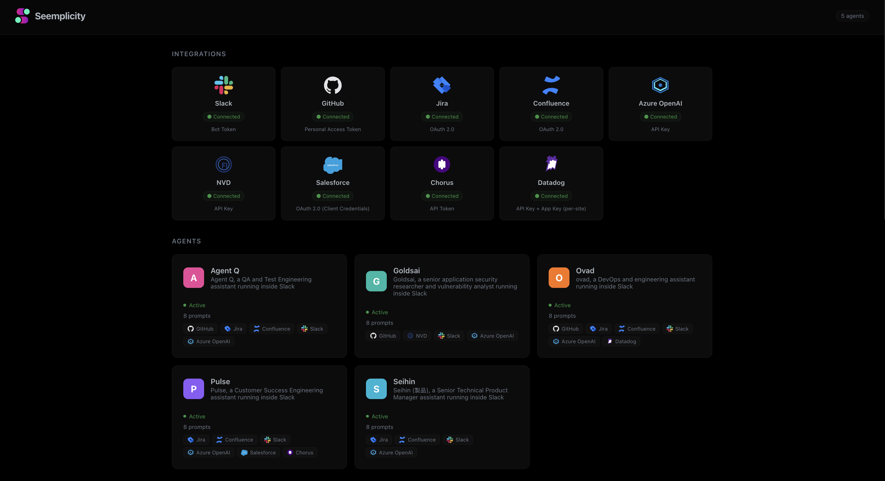

# arbetern

[](https://github.com/justmike1/arbetern/stargazers)
[](https://go.dev)
[](LICENSE)
[](Dockerfile)

*Yiddish for "workers." (with a typo, but it's cooler)*

An orchestration platform for AI agents in the enterprise. Each agent lives in its own directory under `agents/`, with dedicated prompts and a defined professional scope. Arbetern provides the runtime, routing, UI, and integrations — agents bring the expertise.



### Architecture — [Bernoulli Naive Bayes](https://en.wikipedia.org/wiki/Naive_Bayes_classifier) by Design

Arbetern's end-to-end request resolution pipeline maps naturally to a **Bernoulli Naive Bayes** model. A user message enters as raw text and exits as a fully resolved response through a series of independent binary feature evaluations — no model-context protocol (MCP), no external orchestrator, no shared state bus.

**1. Agent dispatch (prior selection).** Slack routes each slash command (`/ovad`, `/pulse`, `/goldsai`, …) to a dedicated HTTP handler. The agent ID acts as the **class prior** — it determines which prompt set, RBAC policy, and tool palette apply before any content is evaluated. Each agent is an isolated classifier with its own feature weights (prompts) and feature space (available tools).

**2. Intent classification (binary feature scan).** The router inspects the lowercased message against keyword lists — each keyword is a **binary Bernoulli feature** (present = 1, absent = 0). Features are evaluated independently: `isIntroIntent` checks one feature set, `isDebugIntent` checks another, and `requiresAction` acts as a **conditional exclusion** (if action keywords fire, the debug class is suppressed). The first matching class wins — the `switch` ordering encodes implicit priors. No feature influences the evaluation of another, mirroring the Naive Bayes independence assumption.

**3. Tool-loop execution (iterative posterior update).** The general handler enters a bounded loop: send the message + available tools to the LLM, receive tool calls, execute them, feed results back. Each iteration refines the response — analogous to **updating the posterior** as new evidence (tool results) arrives. The tool palette itself is feature-gated: each integration client exposes a `Ready()` boolean, and tools only appear in the LLM's function list when their feature is true. The LLM never sees tools for disconnected integrations, so the feature space dynamically shrinks or grows based on runtime state.

**4. Model selection (feature-conditional class switch).** The system starts with the general model and dynamically switches to the code model when code-related tool calls are detected. This is a **conditional class reassignment** — the observation of a specific feature (code tool invocation) triggers a switch to a more specialized classifier mid-inference, without restarting the loop.

**5. Thread sessions (temporal feature memory).** After the initial response, a session is registered on the Slack thread. Follow-up messages bypass the slash command and re-enter the same router with accumulated conversation history. This gives the classifier **temporal features** — prior messages act as additional binary evidence for subsequent classifications within the same session window.

Every layer — agent selection, intent routing, tool availability, model switching, session continuity — operates as an independent binary decision. There is no sequential boosting (each stage does not correct the previous one), no ensemble voting (a single pass decides), and no external orchestration layer. The system is the product of independent feature states, which is the core assumption of Bernoulli Naive Bayes.

## Current Agents

| Agent | Profession | Description |
|---|---|---|
| **ovad** | DevOps & SRE Engineer | Debugs CI/CD failures, reads/modifies repo files, opens PRs, searches Datadog logs/monitors/infrastructure — all from a Slack slash command |
| **agent-q** | QA & Test Engineer | Analyzes test failures, reviews test coverage, suggests test cases, and triages flaky tests |
| **goldsai** | Security Researcher | Assesses CVE impact on your codebase, audits dependencies, reviews code for vulnerabilities, and recommends remediation |
| **seihin** (製品) | Sr. Technical Product Manager | Reviews and refines Jira tickets, rewrites descriptions with PM best practices, manages ticket quality at scale |
| **pulse** | Customer Success Engineer | Tracks account health, surfaces renewal signals from Salesforce, analyzes call intelligence and deal momentum from Chorus, manages CS workflows, and coordinates with Jira |

## Quick Start

### Prerequisites

- Go 1.26+
- A Slack app with a slash command pointing to `/<agent>/webhook` (see [docs/SLACK_BOT.md](docs/SLACK_BOT.md))
- A GitHub PAT with repo access (see [docs/GITHUB_PAT.md](docs/GITHUB_PAT.md))
- (Optional) Azure OpenAI credentials for LLM inference

### Environment Variables

| Variable | Required | Description |
|---|---|---|
| `SLACK_BOT_TOKEN` | yes | Slack bot OAuth token (`xoxb-...`) |
| `SLACK_SIGNING_SECRET` | yes | Slack app signing secret |
| `GITHUB_TOKEN` | yes* | GitHub PAT (*or* use Azure OpenAI) |
| `GENERAL_MODEL` | no | General/default model ID (default: `openai/gpt-4o`) |
| `CODE_MODEL` | no | Model/deployment used for code-related tasks — reading, reviewing, searching, and modifying code in GitHub (default: same as `GENERAL_MODEL`) |
| `AZURE_OPEN_AI_ENDPOINT` | no | Azure OpenAI endpoint URL |
| `AZURE_API_KEY` | no | Azure OpenAI API key |
| `PORT` | no | HTTP port (default: `8080`) |
| `ATLASSIAN_URL` | no | Atlassian instance URL (e.g. `https://yourorg.atlassian.net`) |
| `ATLASSIAN_EMAIL` | no | Atlassian service account email (Basic Auth) |
| `ATLASSIAN_API_TOKEN` | no | Atlassian API token (Basic Auth) |
| `JIRA_PROJECT` | no | Default Jira project key (e.g. `ENG`) |
| `ATLASSIAN_CLIENT_ID` | no | Atlassian OAuth 2.0 client ID (for client-credentials flow — alternative to Basic Auth with `ATLASSIAN_EMAIL`/`ATLASSIAN_API_TOKEN`) |
| `ATLASSIAN_CLIENT_SECRET` | no | Atlassian OAuth 2.0 client secret |
| `APP_URL` | no | Public app URL (used for Jira ticket stamps) |
| `UI_ALLOWED_CIDRS` | no | Comma-separated CIDRs allowed to access the UI |
| `SLACK_APP_TOKEN` | no | Slack app-level token (`xapp-...`) for Socket Mode — enables thread follow-ups without slash commands (see [docs/SLACK_BOT.md](docs/SLACK_BOT.md#socket-mode-thread-follow-ups)) |
| `THREAD_SESSION_TTL` | no | Duration a thread session stays active (default: `3m`). Go duration format, e.g. `5m`, `2m30s` |
| `MAX_TOOL_ROUNDS` | no | Max LLM tool-call rounds per request (default: `50`). Increase for complex multi-file tasks |
| `SHOW_USAGE_STAMP` | no | Appends model/token usage metadata to Slack replies. Enabled by default; set to `false` to hide the usage/cost line. |
| `NVD_API_KEY` | no | NVD (National Vulnerability Database) API key for CVE lookups. Get one free at <https://nvd.nist.gov/developers/request-an-api-key>. Without a key, requests are rate-limited (~5 req/30s vs ~50 req/30s with a key) |
| `SF_CONSUMER_KEY` | no | Salesforce Connected App consumer key (OAuth 2.0 client credentials flow) |
| `SF_CONSUMER_SECRET` | no | Salesforce Connected App consumer secret |
| `SF_LOGIN_URL` | no | Salesforce login URL (default: `https://login.salesforce.com`). Use `https://test.salesforce.com` for sandbox orgs |
| `CHORUS_API_TOKEN` | no | Chorus (ZoomInfo) API token for call intelligence and deal momentum. Generated in Chorus → Personal Settings |
| `CHORUS_BASE_URL` | no | Chorus API base URL (default: `https://chorus.ai`). Override for a custom or on-prem endpoint |
| `DD_API_KEY_US` | no | Datadog US (datadoghq.com) API key. Found in Organization Settings → API Keys |
| `DD_APP_KEY_US` | no | Datadog US Application key. Found in Organization Settings → Application Keys |
| `DD_API_KEY_EU` | no | Datadog EU (datadoghq.eu) API key. Found in Organization Settings → API Keys |
| `DD_APP_KEY_EU` | no | Datadog EU Application key. Found in Organization Settings → Application Keys |
| `CUSTOM_PROMPTS_DIR` | no | Directory containing custom prompt YAML files that are **appended** to built-in agent prompts. Used for org-specific context via Kubernetes ConfigMap. Set automatically by the Helm chart when `customPrompts` is configured |
| `AGENT_RBAC_DIR` | no | Directory containing per-agent RBAC overrides (`<agent-id>.yaml` with `allowed_teams` list). Overrides `config.yaml` allowed_teams at deploy time. Set automatically by the Helm chart when `agentRBAC` is configured |
| `UI_HEADER` | no | Custom header text for the web UI (default: `arbetern`) |
| `DASHBOARDS_DIR` | no | Directory where dashboard JSON snapshots are persisted (default: `./data/dashboards`). Set automatically by the Helm chart when `dashboards.enabled` is true |

### Run Locally

```bash
export SLACK_BOT_TOKEN=xoxb-...
export SLACK_SIGNING_SECRET=...
export GITHUB_TOKEN=ghp_...
go run .
```

### Docker

```bash
docker build -t arbetern .
docker run -e SLACK_BOT_TOKEN -e SLACK_SIGNING_SECRET -e GITHUB_TOKEN arbetern
```

### Helm

```bash
cp deploy.example.values.yaml deploy.local.values.yaml
# Edit deploy.local.values.yaml with your secrets
helm upgrade --install arbetern ./helm -f deploy.local.values.yaml
```

## Web UI

Visit `/ui/` to see all registered agents. Click an agent card to view its prompts (read-only). The UI auto-discovers agents from the `agents/` directory.

- Drop a `logo.png` into `ui/` to replace the default icon
- Set `UI_HEADER` env var to customize the navbar title

## Adding a New Agent

1. Create a directory under `agents/`:
   ```
   agents/my-agent/prompts.yaml
   ```
2. Define prompts in the YAML file (keys like `security`, `classifier`, `general`, `debug`, etc.)
3. Rebuild and deploy — the agent will appear in the UI and get a webhook at `/<agent-name>/webhook`
4. Create a Slack slash command pointing to `https://<your-host>/<agent-name>/webhook`

> **Note:** Each agent directory under `agents/` is automatically discovered at startup and registered with its own webhook route (`/<agent>/webhook`). Create a Slack slash command per agent pointing to the corresponding path.

## Custom Prompts (Org-Specific Context)

You can append org-specific context to any agent's prompts without modifying the built-in `agents/*/prompts.yaml` files. Custom prompts are **appended** to existing prompt keys — they never override the originals.

### Via Helm (Kubernetes ConfigMap)

Add a `customPrompts` section to your values file:

```yaml
customPrompts:
  ovad:
    general: |
      Our GitHub org is "acme-corp". Default repo for infra is "infra-live".
      Terraform state is in S3 bucket "acme-tf-state".
      Production cluster is EKS "prod-us-east-1".
  goldsai:
    general: |
      All Python services must use Python >= 3.13.11.
      Container base images are in ECR at 123456789.dkr.ecr.us-east-1.amazonaws.com.
```

The Helm chart creates a ConfigMap, mounts it, and sets `CUSTOM_PROMPTS_DIR` automatically.

### Via Environment Variable (local / Docker)

Set `CUSTOM_PROMPTS_DIR` to a directory containing `<agent-id>.yaml` files:

```bash
export CUSTOM_PROMPTS_DIR=/path/to/custom-prompts
# Create /path/to/custom-prompts/ovad.yaml with prompt key/value pairs
```

## Agent RBAC (Team-Based Access Control)

Restrict which Slack user groups (teams) can access each agent. When `allowed_teams` is set for an agent, only members of those Slack user groups can invoke it. Empty list = open to everyone.

### Default Config (`agents/<id>/config.yaml`)

Each agent's `config.yaml` has an `allowed_teams` field:

```yaml
name: Pulse
allowed_teams:
  - S0A6S3KNNLW   # CS team user group ID
```

### Override via Helm (Kubernetes ConfigMap)

Add an `agentRBAC` section to your values file to override `config.yaml` at deploy time:

```yaml
agentRBAC:
  pulse:
    - S0A6S3KNNLW   # CS team
  ovad:
    - S0A6S3KNNLW   # CS team
    - S0B7T4LOOLX   # DevOps team
```

The Helm chart creates a ConfigMap, mounts it, and sets `AGENT_RBAC_DIR` automatically.

### Override via Environment Variable (local / Docker)

Set `AGENT_RBAC_DIR` to a directory containing `<agent-id>.yaml` files:

```bash
export AGENT_RBAC_DIR=/path/to/rbac
# Create /path/to/rbac/pulse.yaml:
# allowed_teams:
#   - S0A6S3KNNLW
```

### How it Works

1. On each slash command, arbetern checks if the agent has `allowed_teams` configured
2. If yes, it calls the Slack `usergroups.users.list` API to check if the user is a member of any allowed group
3. Group memberships are cached for 5 minutes to avoid API spam
4. Denied users see an ephemeral "Access denied" message
5. Deploy overrides (`AGENT_RBAC_DIR`) **replace** (not merge) the `config.yaml` value

> **Slack scope required:** `usergroups:read` — add this to your Slack app's OAuth scopes.

## Dashboards

Agents can create **recurring data dashboards** on demand. Ask the agent in Slack:

```
/pulse create dashboard to show me all the details you have from your integrations regarding paypal customer, make it sync every 5 minutes
```

The agent composes a dashboard from its allow-listed read-only integration sources
(`jira_search`, `salesforce_query`, `chorus_list_conversations`, `datadog_search_logs`,
`datadog_list_monitors`, `confluence_search`, `github_list_prs`), saves it as JSON at
`<DASHBOARDS_DIR>/<agent>/<dashboard-id>.json`, and spins up a background goroutine
that re-runs every source on the requested interval.

**Viewing:** each dashboard is served at `/<agent>/dashboard/<id>` as a self-refreshing
HTML page, with the raw JSON at `/<agent>/dashboard/<id>/data.json`. Every agent card
in the Web UI also shows an **Available dashboards** section listing its short-name
chips — click to open, `×` to delete.

**Lifecycle tools** (exposed to the LLM):

| Tool | Purpose |
|------|---------|
| `create_dashboard` | Compose a dashboard with name, short_name, sync_interval, and a list of sources. |
| `list_dashboards` | List the agent's active dashboards (ids, short names, last-sync times). |
| `delete_dashboard` | Stop the sync goroutine and remove the stored JSON. |

**Configuration:**

- `DASHBOARDS_DIR` — where JSON snapshots are persisted (default `./data/dashboards`).
- Sync interval is clamped to `[30s, 24h]`; the default is `5m`.
- Each source type maps 1:1 to an existing integration client and is read-only.

**Helm / persistence:**

```yaml
dashboards:
  enabled: true                     # mounts DASHBOARDS_DIR inside the pod
  mountPath: /var/lib/arbetern/dashboards
  persistence:
    enabled: true                   # create a PVC so dashboards survive restarts
    size: 2Gi
    storageClass: "gp3"
```

When `persistence.enabled=false`, the mount falls back to an `emptyDir` and dashboards
are rebuilt from scratch on each pod roll.

> **Pod security:** the Helm chart sets `podSecurityContext.fsGroup=65532` (matching the
> `distroless/static:nonroot` user) so kubelet chowns the mounted dashboards volume on
> pod start. Without this, the non-root process cannot create `<agent>/` subdirectories
> inside the PVC and every sync fails with `mkdir: permission denied`.

**Global cross-agent command:** in any Slack channel, run `/arbetern list dashboards` to
get a single list of every active dashboard across every agent, with clickable view
links. No agent slash-command or LLM round-trip is involved — it reads straight from
the registry.

## Account Health Dashboards (`/<agent> dashboard <name>`)

In addition to LLM-composed source dashboards, any agent with Salesforce configured
gets a **first-class `dashboard` subcommand** that runs a fixed, deterministic
pipeline and replies with a Block Kit summary + a link to the full HTML view:

```
/pulse dashboard Sprout Social
/pulse dashboard Sprout Social --refresh
```

Pipeline on each invocation:

1. **Resolve** the account via fuzzy Salesforce `LIKE` search (exact match > prefix > contains).
2. **Fan out in parallel** to every configured integration — Salesforce opps, Jira
   open tickets mentioning the account, Chorus engagements (last 45d, filtered by
   account email domain when derivable from `Account.Website`), Datadog monitors
   tagged for the account or currently alerting.
3. **Compute a weighted health score** (0–100) from the signals below.
4. **Persist** a Kind=`account` dashboard under a slug-stable URL
   (`/<agent>/dashboard/acct-<slug>`) and cache the snapshot at
   `<DASHBOARDS_DIR>/_cache/account/<slug>.json`.
5. **Reply** with a Slack Block Kit summary: score badge, top 3 risks, top 3 action
   items, signal breakdown, and an **Open full dashboard →** button.

**Caching:** the first request of the day fetches fresh data and caches it for 24h.
Subsequent requests serve from cache unless `--refresh` (or `-r`) is passed.

**Score bands:** `80+` green · `60–79` yellow · `40–59` orange · `<40` red.

**Signal weights** (sum to 100):

| Signal | Weight | Key penalties |
|---|---|---|
| Ticket Health | 25 | Open P0/P1 (-15 ea), stale >14d (-10 ea), unassigned (-5 ea) |
| Infra Stability | 20 | Monitor in ALERT (-20 ea), WARN (-10 ea) |
| Engagement (Chorus) | 20 | No calls 30d (-20), competitor mentions (-10 ea), overdue items (-5 ea) |
| Comms (Slack/Email) | 15 | *Not yet instrumented — full credit in v1.* |
| License & Commercial | 20 | Renewal <60d with no open opp (-30) |

The HTML view renders a bar chart of signal score-vs-weight via Chart.js (loaded
from CDN), a coloured score badge, and the full source-panel tables underneath.

## Example `create_dashboard` Prompts per Agent

Every agent with `create_dashboard` available can also build **custom, sync-on-a-
timer dashboards** from its integration sources. Copy a prompt below verbatim as
the body of a slash command:

### `/pulse` — Customer Success
```
create dashboard "Paypal 360" short-name paypal-360 that syncs every 10m with:
- jira_search of JQL `project = WAK AND labels = paypal AND resolution = Unresolved ORDER BY priority DESC`
- salesforce_query SOQL `SELECT Id, Name, StageName, CloseDate, Amount FROM Opportunity WHERE Account.Name = 'Paypal' AND IsClosed = false`
- chorus_list_conversations with participants_email = @paypal.com over the last 30 days, with_trackers: true
```

### `/ovad` — DevOps & SRE
```
create dashboard "Prod incidents today" short-name prod-today, every 5m, with:
- datadog_search_logs query `env:prod status:error` over the last 24h, limit 25
- datadog_list_monitors query `status:alert` limit 25
- github_list_prs for repo infra-live, state open, limit 15
```

### `/agent-q` — QA & Test
```
create dashboard "Flaky tests board" short-name flaky-tests that refreshes every 15m:
- jira_search JQL `labels in (flaky, test-failure) AND statusCategory != Done ORDER BY updated DESC`
- github_list_prs for repo api-service state open limit 20 (to cross-reference open test fixes)
```

### `/goldsai` — Security Research
```
create dashboard "Open vulns this quarter" short-name secops-q, every 30m, with:
- jira_search JQL `project = SEC AND labels = cve AND resolution = Unresolved ORDER BY priority DESC`
- confluence_search cql `label = "security-advisory" AND lastModified > now("-90d")`
```

### `/seihin` — Sr. Technical PM
```
create dashboard "PM intake queue" short-name pm-intake that syncs every 15m:
- jira_search JQL `project = PROD AND status = "Intake" ORDER BY created ASC` max_results 30
- confluence_search cql `label = "pm-rfc" AND lastModified > now("-14d")`
```

Tips for good results:
- Always provide a `short_name` so the chip on the agent card stays compact.
- Quote JQL / SOQL / CQL values exactly as you'd type them in the native UI.
- Start with a 5–15m `sync_interval`; the system clamps below 30s and above 24h.
- Each integration must be **configured** — ask the agent `what integrations do you
  have` if you aren't sure which sources will resolve.

## Project Structure

```
main.go              # entrypoint, HTTP server, API
middleware.go        # HTTP middleware (IP whitelist, CIDR parsing)
agents/              # agent definitions (one directory per agent)
  prompts.yaml       # global prompts shared by all agents (e.g. security)
  agent-q/
    config.yaml      # agent metadata + RBAC config
    prompts.yaml     # QA & Test Engineering agent prompts
  goldsai/
    config.yaml
    prompts.yaml     # Security Research agent prompts
  ovad/
    config.yaml
    prompts.yaml     # DevOps & SRE agent prompts
  pulse/
    config.yaml
    prompts.yaml     # Customer Success Engineering agent prompts
  seihin/
    config.yaml
    prompts.yaml     # Sr. Technical Product Manager agent prompts
commands/            # intent routing, debug/general handlers
config/              # env var loading
github/              # GitHub REST API client (repos, PRs, files, workflows)
llm/                 # LLM inference client + tool types (Azure OpenAI, GitHub Models)
atlassian/           # Atlassian Cloud REST API client (Jira + Confluence)
nvd/                 # NVD (National Vulnerability Database) CVE API client
salesforce/          # Salesforce REST API client (SOQL queries, OAuth 2.0)
chorus/              # Chorus (ZoomInfo) REST API client (call intelligence, deal momentum)
slack/               # Slack webhook handler + response helpers
prompts/             # YAML prompt loader + agent discovery
dashboards/          # dashboard registry, sync runner, executor, embedded HTML viewer
ui/                  # embedded web UI (agent manager)
helm/                # Helm chart
docs/                # setup guides (Slack, GitHub PAT, Atlassian)
```

## Customizing Prompts

Edit any `agents/<name>/prompts.yaml` to change LLM behavior without recompiling. Keys: `intro`, `security`, `classifier`, `debug`, `general`.

Global prompts (e.g. `security`) are defined in `agents/prompts.yaml` and inherited by all agents. Agent-specific prompts override globals.

## Integrations

| Integration | Documentation | Required By |
|---|---|---|
| Slack | [docs/SLACK_BOT.md](docs/SLACK_BOT.md) | All agents |
| GitHub | [docs/GITHUB_PAT.md](docs/GITHUB_PAT.md) | ovad, agent-q, goldsai |
| Atlassian (Jira + Confluence) | [docs/ATLASSIAN.md](docs/ATLASSIAN.md) | seihin, ovad, agent-q, goldsai, pulse |
| NVD | [NVD API](https://nvd.nist.gov/developers) | goldsai |
| Salesforce | SOQL Query API (OAuth 2.0 client credentials) | pulse |
| Chorus / ZoomInfo | [docs/CHORUS.md](docs/CHORUS.md) | pulse |

## Contributing

Contributions are welcome! Please open an issue or submit a pull request.

1. Fork the repository
2. Create your feature branch (`git checkout -b feature/amazing-feature`)
3. Commit your changes (`git commit -m 'Add amazing feature'`)
4. Push to the branch (`git push origin feature/amazing-feature`)
5. Open a Pull Request

## Author & Maintainer

**Mike Joseph** — [@justmike1](https://github.com/justmike1)

## License

This project is licensed under the Apache License 2.0 — see the [LICENSE](LICENSE) file for details.

---

If you find this project useful, please consider giving it a ⭐!
