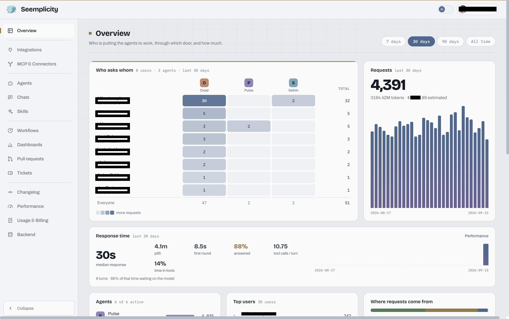
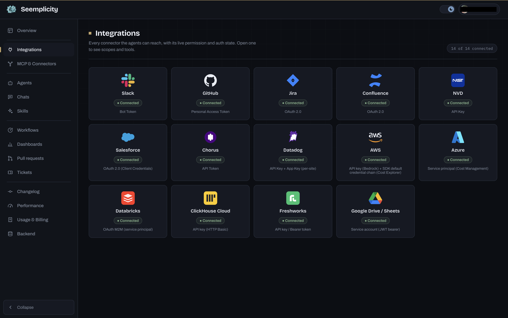
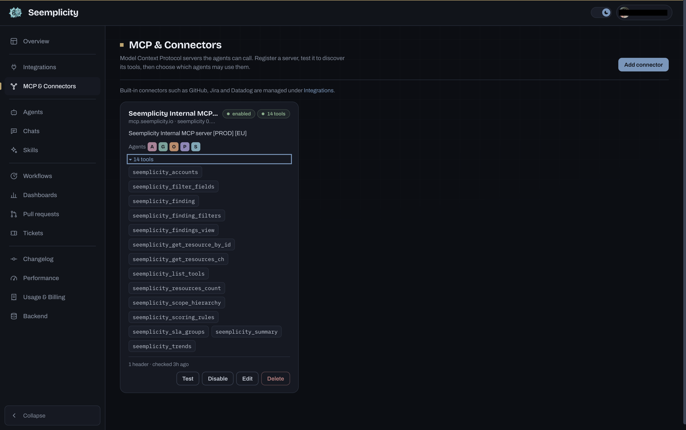
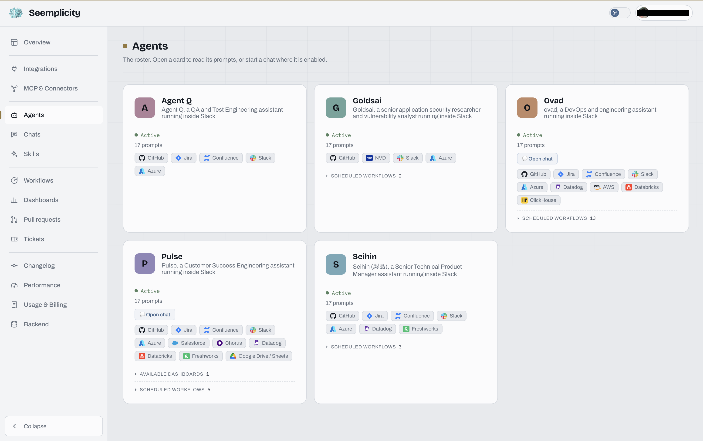
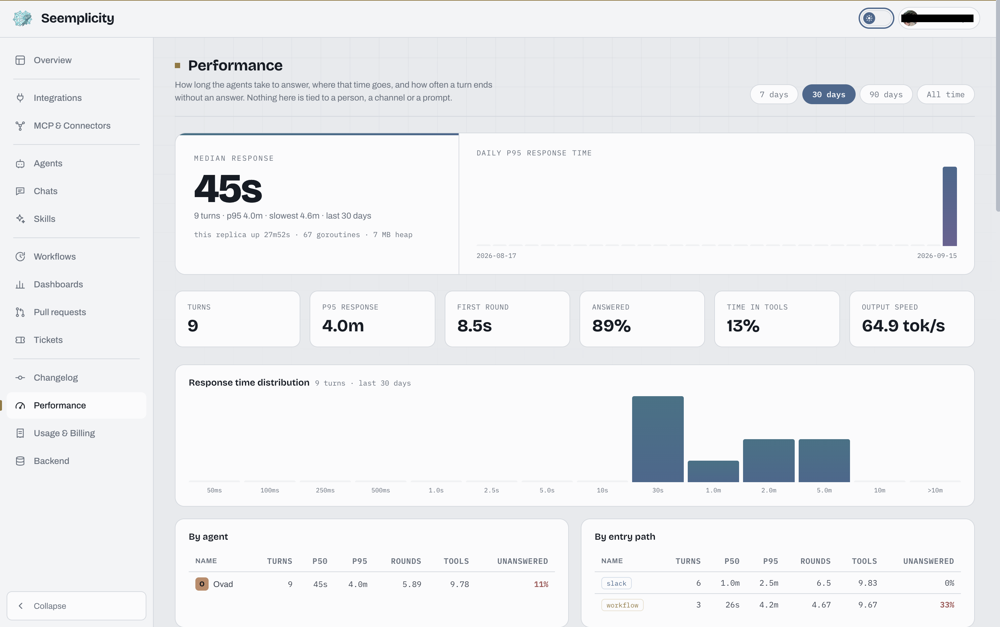

# Screenshots

A visual tour of the Arbetern console. Every page renders inside the same
shell — collapsible side rail, light/dark toggle — so the tour follows the
rail from top to bottom.

## Overview

The console opens on **Overview**: who is putting the agents to work, through
which door, and how much. The "who asks whom" matrix cross-tabs users against
agents, next to request volume and estimated token spend for the selected
window (7 / 30 / 90 days, all time). Below it, response-time headlines, the
agent roster with per-agent volume, top users, and where requests come from.

## Integrations

Every connector the agents can reach, with its live permission and auth state
— Slack, GitHub, Jira, Confluence, NVD, Salesforce, Chorus, Datadog, AWS,
Azure, Databricks, ClickHouse Cloud, Freshworks, Google Drive / Sheets. Each
card names the credential type behind it; opening one shows scopes and tools.

## MCP & Connectors

Model Context Protocol servers the agents can call. Register a server, test it
to discover its tools, then pick which agents may use them. The card shows the
enabled state, the discovered tool list, which agents are allowed, and when the
server was last checked.

## Agents

The roster. Each card carries the agent's description, active state, prompt
count, and the integrations it is wired to. Expanding a card reveals its
scheduled workflows and available dashboards; where chat is enabled, the card
opens one directly.

## Performance

How long the agents take to answer, where that time goes, and how often a turn
ends without an answer — median and p95 response, first-round latency, answered
rate, time in tools, output speed. The distribution histogram and the by-agent
and by-entry-path tables break the same numbers down. Nothing on this page is
tied to a person, a channel, or a prompt.

