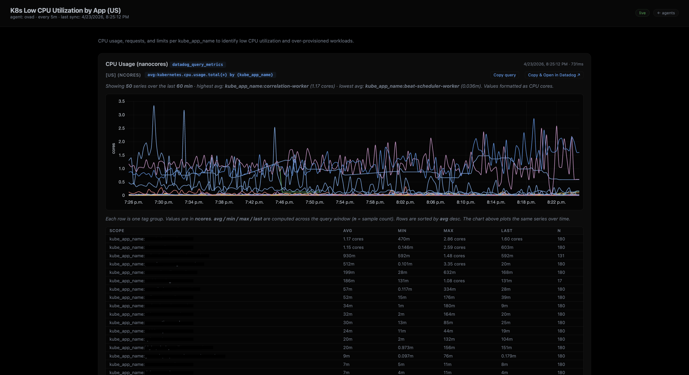
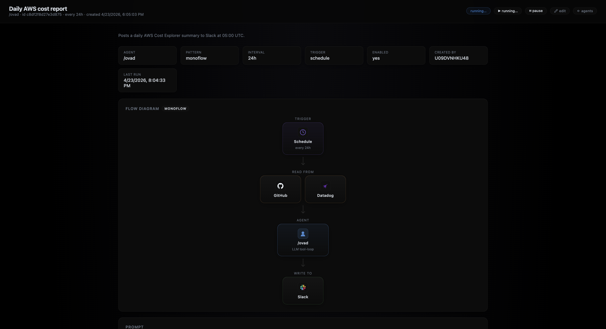
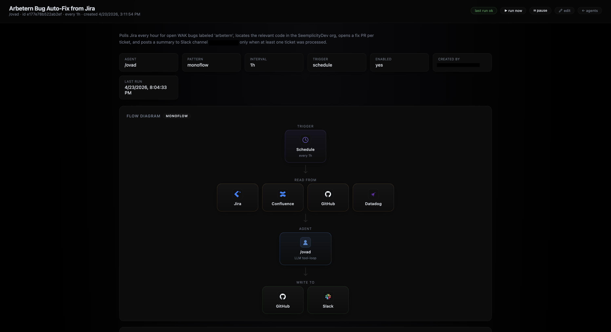
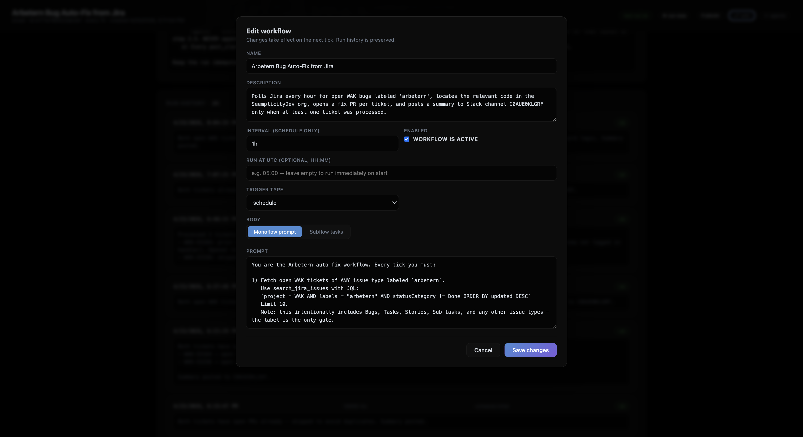

# Screenshots

A visual tour of the Arbetern UI.

## Home

The landing page lists every configured agent and links into their dashboards,
workflows, and chat surfaces.

## Dashboard

A dashboard view — scheduled snapshots of an agent's data sources rendered as
Markdown, refreshed on the cadence configured at creation time.

## Workflows — Grid

The workflow grid for an agent: each card shows the schedule, last-run status,
and the live "running" badge while a tick is in flight.

## Workflow Editor

Editing a workflow: prompt, schedule (`interval` or `run_at_utc`), trigger
type, and the auto-detected source/output integration flow diagram.

